## SpigotKM (Spigot Kotlin Maven)

A Spigot plugin made in Kotlin using Maven.

---

### About this repository

This repository is a simple and small guide of how to set up a Spigot plugin, coded Kotlin and using Maven as our
project manager.

In this guide, we will be using Spigot 1.16.5 alongside with Kotlin 1.5.10 (Which are the most recent versions at the
moment).

---

### Creating the project

First we want to create the project. Select Maven and click next.

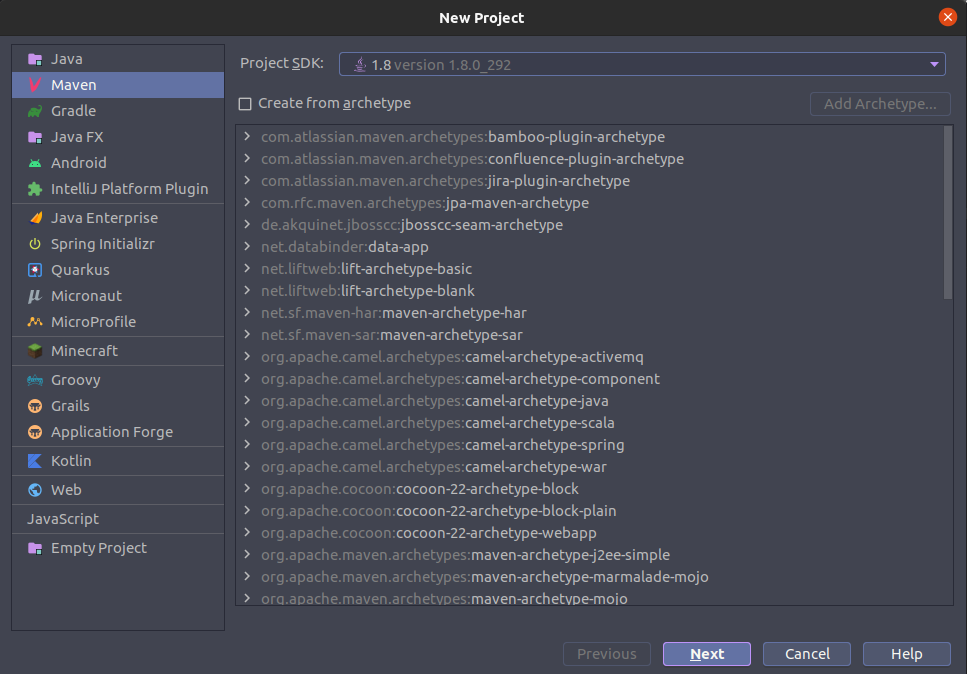

At this part you may want to set up the configurations about your project, such as the name.

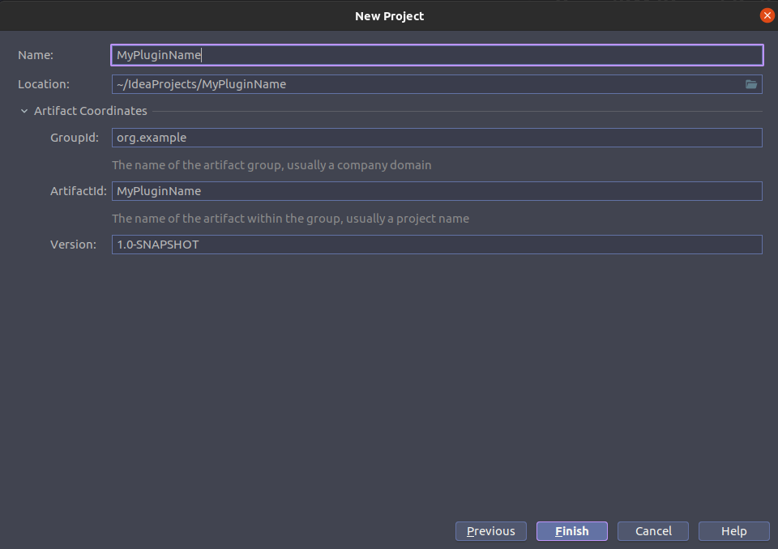

### Dependencies

Soon as your project opens, you will be greeted with your pom.xml file, it contains all the dependencies and build
information.

```xml
<?xml version="1.0" encoding="UTF-8"?>
<project xmlns="http://maven.apache.org/POM/4.0.0"
         xmlns:xsi="http://www.w3.org/2001/XMLSchema-instance"
         xsi:schemaLocation="http://maven.apache.org/POM/4.0.0 http://maven.apache.org/xsd/maven-4.0.0.xsd">
    <modelVersion>4.0.0</modelVersion>

    <groupId>org.example</groupId>
    <artifactId>MyPluginName</artifactId>
    <version>1.0-SNAPSHOT</version>

    <properties>
        <maven.compiler.source>8</maven.compiler.source>
        <maven.compiler.target>8</maven.compiler.target>
    </properties>

</project>
```

Because we are using Maven as our project management and building tool, we can enjoy of all it's features. Which means,
for example, that you don't need to download the spigot.jar file, since it will happen automatically when you add it as
a dependency.

#### Spigot

The first dependency we want to add is the Spigot, but first we need to add its repository in our project, which is
pretty simple. Add the following line of codes to your pom.xml file.

```xml

<repositories>
    <repository>
        <id>spigot-repo</id>
        <url>https://hub.spigotmc.org/nexus/content/repositories/snapshots/</url>
    </repository>
</repositories>
```

Basically, what we are saying is that we want to add the
link "https://hub.spigotmc.org/nexus/content/repositories/snapshots/" as a repository for our project. By saying that,
we gain access to all of its artifacts, so on we can add any of them as a dependency.

Next, let's add Spigot 1.16.5 as a dependency.

```xml

<dependencies>
    <dependency>
        <groupId>org.spigotmc</groupId>
        <artifactId>spigot-api</artifactId>
        <version>1.16.5-R0.1-SNAPSHOT</version>
        <scope>provided</scope>
    </dependency>
</dependencies>
```

Now that we have Spigot, you may use it as an api, just as you would if you had downloaded it.

#### Kotlin

Now the fun part, let's add Kotlin to the project. Start by refactoring the java directory to Kotlin.

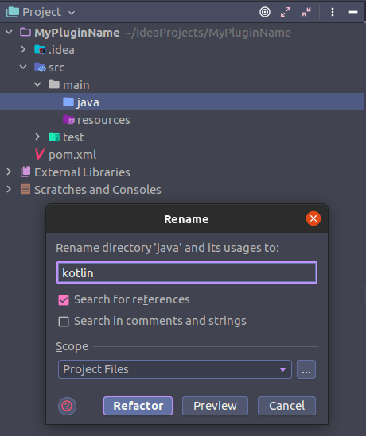

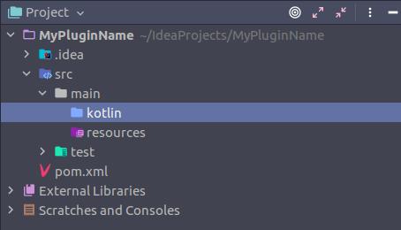

The next step is adding Kotlin version as a 'variable', that way you can easily change the version in the future without
having to change the whole pom.xml

```xml

<properties>
    <kotlin.version>1.5.10</kotlin.version>
</properties>
```

`You may see something like <maven.compiler.target>8</maven.compiler.target> in there, just leave as default and don't worry about it.`

Now let's add Kotlin in our dependencies.

```xml

<dependencies>
    <dependency>
        <groupId>org.spigotmc</groupId>
        <artifactId>spigot-api</artifactId>
        <version>1.16.5-R0.1-SNAPSHOT</version>
        <scope>provided</scope>
    </dependency>
    <dependency>
        <groupId>org.jetbrains.kotlin</groupId>
        <artifactId>kotlin-stdlib</artifactId>
        <version>${kotlin.version}</version>
    </dependency>
    <dependency>
        <groupId>org.jetbrains.kotlin</groupId>
        <artifactId>kotlin-test-junit5</artifactId>
        <version>${kotlin.version}</version>
    </dependency>
</dependencies>
```

${kotlin.version} will reflect the version we've defined in our config.

### Coding

Now that we have Spigot and Kotlin, you sure want to do some coding, so let's begin.

First we create the main class (or any other class you may want):

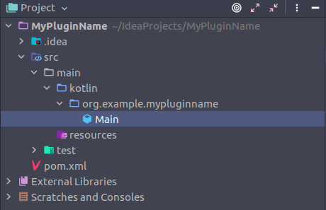

Will look like this:

```kotlin
package org.example.mypluginname

class Main {
}
```

Next, we extend the JavaPlugin class:

```kotlin
package org.example.mypluginname

import org.bukkit.plugin.java.JavaPlugin

class Main : JavaPlugin() {
}
```

Some logic and messages:

```kotlin
package org.example.mypluginname

import org.bukkit.plugin.java.JavaPlugin

class Main : JavaPlugin() {

    override fun onEnable() {
        Bukkit.getConsoleSender().sendMessage("§aHello, i'm a plugin made in Kotlin!")
    }

    override fun onDisable() {
        Bukkit.getConsoleSender().sendMessage("§cGood Bye.")
    }
}
```

You can take a look at some other methods and examples at the `/src` folder.

### Plugin.yml

Don't forget to add the plugin.yml file and its configs

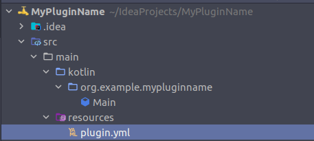

```text
name: MyPluginName
main: org.example.mypluginname.Main
version: 1.0.0
```

### Compiling

This part is a bit long and complex, we won't be going deep on it, but you can search more about it later on.

First, compiling the plugin right as you usually would, will probably lead to a crash.

Why? Well, when you compile the .jar file, it results in a small version without the Kotlin libraries, and since we are
using Kotlin to code the plugins, this is a problem.

So, what we have to do is tell Maven to compile our plugin including all the necessary Kotlin libraries. We will do that
by telling it to shade Kotlin in our .jar, resulting in an "uber .jar".

```xml

<build>
    <sourceDirectory>src/main/kotlin</sourceDirectory>
    <plugins>
        <plugin>
            <groupId>org.jetbrains.kotlin</groupId>
            <artifactId>kotlin-maven-plugin</artifactId>
            <version>${kotlin.version}</version>
            <executions>
                <execution>
                    <id>compile</id>
                    <goals>
                        <goal>compile</goal>
                    </goals>
                    <configuration>
                        <sourceDirs>
                            <sourceDir>${project.basedir}/src/main/kotlin</sourceDir>
                        </sourceDirs>
                    </configuration>
                </execution>
                <execution>
                    <id>test-compile</id>
                    <goals>
                        <goal>test-compile</goal>
                    </goals>
                    <configuration>
                        <sourceDirs>
                            <sourceDir>${project.basedir}/src/main/kotlin</sourceDir>
                        </sourceDirs>
                    </configuration>
                </execution>
            </executions>
        </plugin>
        <plugin>
            <groupId>org.apache.maven.plugins</groupId>
            <artifactId>maven-compiler-plugin</artifactId>
            <version>3.8.1</version>
            <executions>
                <execution>
                    <id>default-compile</id>
                    <phase>none</phase>
                </execution>
                <execution>
                    <id>default-testCompile</id>
                    <phase>none</phase>
                </execution>
                <execution>
                    <id>java-compile</id>
                    <phase>compile</phase>
                    <goals>
                        <goal>compile</goal>
                    </goals>
                </execution>
                <execution>
                    <id>java-test-compile</id>
                    <phase>test-compile</phase>
                    <goals>
                        <goal>testCompile</goal>
                    </goals>
                </execution>
            </executions>
        </plugin>
        <plugin>
            <groupId>org.apache.maven.plugins</groupId>
            <artifactId>maven-shade-plugin</artifactId>
            <version>3.2.4</version>
            <executions>
                <execution>
                    <phase>package</phase>
                    <goals>
                        <goal>shade</goal>
                    </goals>
                </execution>
            </executions>
        </plugin>
    </plugins>
</build>
```

Yeah, it seems a lot at first, but don't panic, you don't need to understand everything right now.

Now let's compile it. Start by opening the maven section on the right side of your editor.

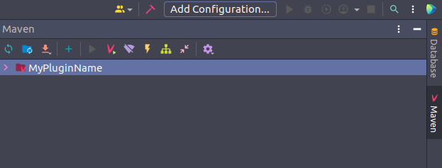

Open the following section and double click `package`.

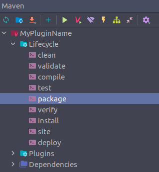

You can see now that a new folder, `target`, has shown up, you can find your compiled plugin there. The one with the
prefix 'original' is the version without Kotlin libraries, so pick the version without such.

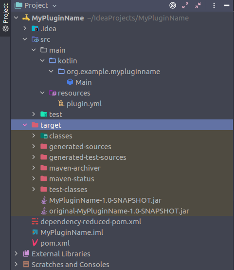

### Running the plugin

After all that effort, add the plugin to your server's plugin folder and let's see it working.

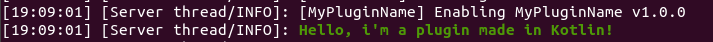

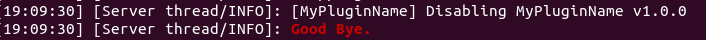

There we go, the plugin is up and running.